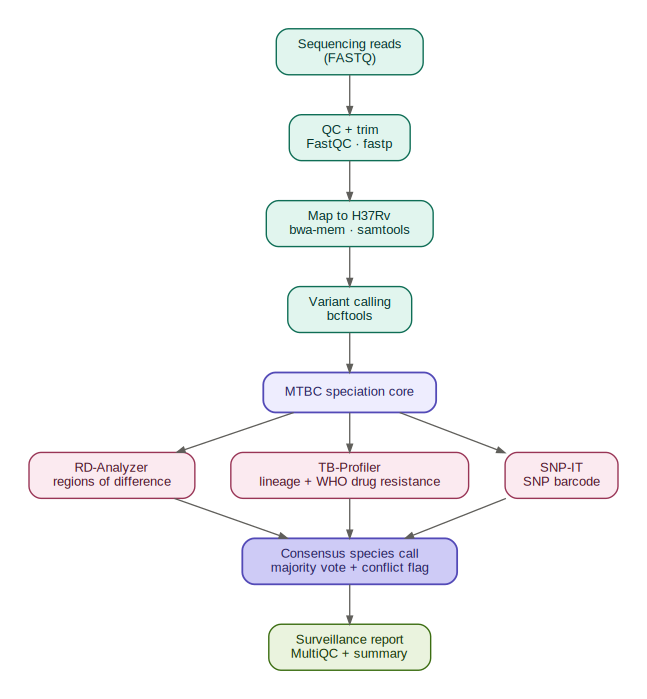

[](https://github.com/hailsgav1/mtbc-speciation-nf/actions/workflows/ci.yml)
# mtbc-speciation-nf

A Nextflow DSL2 pipeline for **zoonotic tuberculosis genomic surveillance** with
accurate speciation across the full *Mycobacterium tuberculosis* complex (MTBC).

Most TB pipelines predict drug resistance well but treat species assignment as an
afterthought — which is exactly why animal-adapted members like ***Mycobacterium
orygis*** are routinely misreported as *M. bovis* or *M. tuberculosis*. This
pipeline puts **MTBC speciation at the centre**: it calls the species from three
independent signals and reconciles them, flagging disagreements for review.

> Built as a One Health surveillance tool — the kind of workflow an animal- or
> public-health reference lab actually runs. *M. orygis* is an emerging,
> under-recognised cause of zoonotic TB, and telling it apart from *M. bovis* is
> a documented diagnostic gap.

## What it does



1. **QC + trim** — FastQC, fastp
2. **Map + call** — bwa-mem to *M. tuberculosis* H37Rv (`NC_000962.3`), bcftools
3. **Speciate (the core)** — RD-Analyzer (Regions of Difference), TB-Profiler
   (sub-lineage + drug resistance vs the WHO catalogue), SNP-IT (SNP barcode),
   reconciled into one consensus call by `bin/speciation_summary.py`
4. **Surveillance** — SNP-distance matrix and optional IQ-TREE phylogeny
5. **Report** — MultiQC summary

## Example result

Validated on a real *M. orygis* isolate from dairy cattle (Chennai, India) —
public accession [`SRR9157804`](https://www.ncbi.nlm.nih.gov/sra/SRR9157804),
mapped to *M. tuberculosis* H37Rv (`NC_000962.3`).

| Tool | Method | Call |
|---|---|---|
| TB-Profiler | SNP barcode + WHO catalogue (containerised) | *M. orygis* (lineage La3, 100%) |
| SNP-IT | whole-genome SNP barcode | *M. orygis* (100%) |
| RD-Analyzer | Regions of Difference (legacy) | *M. caprae* |
| **Consensus** | **majority vote** | ***M. orygis*** *(agreement: conflict flagged)* |

Two independent modern methods agree on *M. orygis*, while the older
RD-based tool calls *M. caprae* — the exact animal-lineage ambiguity this
pipeline is built to surface. The consensus reports *M. orygis* by majority
**and** flags the disagreement rather than hiding it, so a reviewer sees both
the call and the uncertainty.

> This is why speciation is the core of the pipeline: a single tool can
> confidently mis-call an emerging zoonotic agent. Cross-method consensus
> catches it.

## Quick start

```bash
# 1. Test the wiring with no tools or data (stub run)
nextflow run . -profile test -stub-run

# 2. Fetch a small real test set (M. orygis cattle isolate, subsampled)
bash bin/fetch_testdata.sh testdata

# 3. Run for real once tools are on PATH
nextflow run . -profile local \
  --input assets/samplesheet.csv \
  --reference assets/H37Rv.fasta \
  --outdir results
```

## Input

A CSV samplesheet:

```csv
sample,fastq_1,fastq_2,expected_species
orygis_cattle_IN,SRR9157804_1.fastq.gz,SRR9157804_2.fastq.gz,Mycobacterium_orygis
```

`expected_species` is optional and only used to cross-check the consensus call.

## Test data (verified public accessions)

| Species | Accession | Source |
|---|---|---|
| *M. orygis* | `SRR9157804` (PRJNA545406) | dairy cattle, Chennai, India |
| *M. orygis* (more) | `PRJNA934340`, `PRJNA785380` | human + multiple animal hosts |
| mixed MTBC | `PRJNA575883` | incl. *M. orygis*, *M. bovis* BCG, *M. tuberculosis* |
| reference | `NC_000962.3` | *M. tuberculosis* H37Rv (mapping ref) |
| reference | `NC_002945.4` / `LT708304` | *M. bovis* AF2122/97 |

For the remaining panel members, `bin/fetch_testdata.sh` documents ENA queries
(species + `ILLUMINA` + `WGS`) rather than hard-coding runs that may change.

## Profiles

| Profile | Executor | Notes |
|---|---|---|
| `test` | local | tiny bundled data, pair with `-stub-run` |
| `local` | local | laptop / workstation |
| `hpc` | SLURM | UA HPC; Apptainer block ready to enable |
| `cloud` | AWS Batch | **v2 stub** — see roadmap |

## Roadmap

- [x] DSL2 modular pipeline, stub-testable in CI
- [x] Full MTBC speciation with three-way consensus
- [ ] Containerise each process (Docker/Apptainer) and wire into CI
      (images will publish under `docker.io/biowizardhailey/mtbc-speciation-*`)
- [ ] Enable the AWS Batch profile
- [ ] `nextflow_schema.json` polish for Seqera Platform launch

## Notes and honest caveats

- Virulent *M. bovis* and rarer members (*M. caprae*, *M. africanum*) have far
  fewer public genomes than *M. tuberculosis*, so a balanced full-panel test set
  is hard — the demo set may carry a single isolate for rare species.
- Drug-resistance calls follow the WHO mutation catalogue via TB-Profiler; the
  catalogue is periodically updated, so pin the TB-Profiler DB version you use.

## License

MIT — see `LICENSE`.
