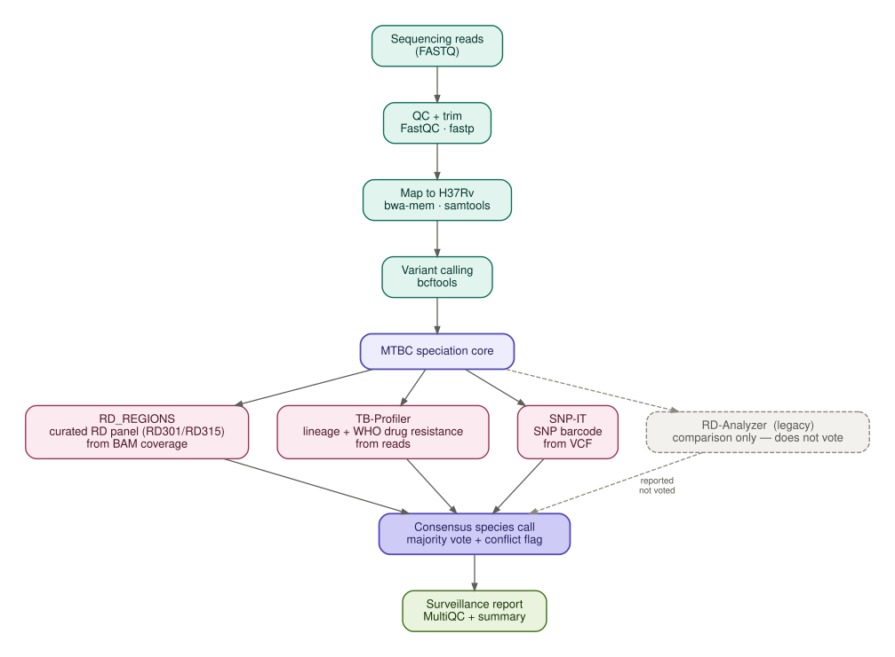

[](https://github.com/hailsgav1/mtbc-speciation-nf/actions/workflows/ci.yml)
# mtbc-speciation-nf

A Nextflow DSL2 pipeline for **zoonotic tuberculosis genomic surveillance** with
accurate speciation across the full *Mycobacterium tuberculosis* complex (MTBC).

Most TB pipelines predict drug resistance well but treat species assignment as an
afterthought — which is exactly why animal-adapted members like ***Mycobacterium
orygis*** are routinely misreported as *M. bovis* or *M. tuberculosis*. This
pipeline puts **MTBC speciation at the centre**: it calls the species from three
methodologically independent signals — regions of difference, SNP barcode, and
lineage typing — and reconciles them, flagging disagreements for review.

> Built as a One Health surveillance tool — the kind of workflow an animal- or
> public-health reference lab actually runs. *M. orygis* is an emerging,
> under-recognised cause of zoonotic TB, and telling it apart from *M. bovis* is
> a documented diagnostic gap.

## What it does



1. **QC + trim** — FastQC, fastp
2. **Map + call** — bwa-mem to *M. tuberculosis* H37Rv (`NC_000962.3`), bcftools
3. **Speciate (the core)** — `RD_REGIONS` (coverage over the curated RDscan
   Regions-of-Difference panel), TB-Profiler (sub-lineage + drug resistance vs
   the WHO catalogue), SNP-IT (SNP barcode), reconciled into one consensus call
   by `bin/speciation_summary.py`. Legacy RD-Analyzer is still run and reported
   for comparison, but does not vote.
4. **Surveillance** — SNP-distance matrix and optional IQ-TREE phylogeny
5. **Report** — MultiQC summary

## Example result

Validated on four public isolates spanning three MTBC species, two hosts, and
three continents. All calls are from a single pipeline run; raw output is in
[`rd_test/validation_4species.tsv`](rd_test/validation_4species.tsv).

| Isolate | Host / origin | RD-Analyzer *(legacy)* | **RD_REGIONS** *(this pipeline)* | TB-Profiler | SNP-IT | Consensus |
|---|---|---|---|---|---|---|
| [`SRR9157804`](https://www.ncbi.nlm.nih.gov/sra/SRR9157804) | *Bos taurus*, India | ❌ *M. caprae* | ✅ ***M. orygis*** | *M. orygis* | *M. orygis* | *M. orygis* (full) |
| [`SRR23445127`](https://www.ncbi.nlm.nih.gov/sra/SRR23445127) | *Homo sapiens*, Canada | ❌ *M. caprae* | ✅ ***M. orygis*** | *M. orygis* | *M. orygis* | *M. orygis* (full) |
| [`ERR016861`](https://www.ebi.ac.uk/ena/browser/view/ERR016861) | *M. bovis* | ✅ *M. bovis* | ✅ ***M. bovis*** | *M. bovis* | *M. bovis* | *M. bovis* (full) |
| [`DRR019437`](https://www.ncbi.nlm.nih.gov/sra/DRR019437) | *Homo sapiens*, Japan | ✅ *M. tuberculosis* | ✅ ***M. tuberculosis*** | *M. tuberculosis* | *M. tuberculosis* | *M. tuberculosis* (full) |

### Surveillance output (`--run_phylo`)

Adding `--run_phylo` builds a masked core-SNP alignment (repetitive PE/PPE and
IS regions excluded via a TB-Profiler mask), a pairwise SNP-distance matrix, and
a bootstrapped IQ-TREE. On the same four isolates:

| | bovis | mtb | orygis (cattle) | orygis (human) |
|---|---|---|---|---|
| **bovis_ERR016861** | 0 | 2183 | 2164 | 2110 |
| **mtb_DRR019437** | 2183 | 0 | 2383 | 2319 |
| **orygis_cattle_IN** | 2164 | 2383 | 0 | **254** |
| **orygis_human_CA** | 2110 | 2319 | **254** | 0 |

The two *M. orygis* isolates — India/cattle and Canada/human — are **254 SNPs
apart**, an order of magnitude closer to each other than to any other species
(~2100–2400 SNPs), and form their own clade with **100% bootstrap support**,
reproducing the known MTBC phylogeny (Brites et al. 2018) from the pipeline's own
output. Raw matrix and tree: [`rd_test/phylo_snp_matrix.tsv`](rd_test/phylo_snp_matrix.tsv),
[`rd_test/phylo_cohort.treefile`](rd_test/phylo_cohort.treefile).

**[🔗 Explore this cohort interactively on Microreact →](https://microreact.org/project/saty9XmF1nN8xReDxsacoJ-mtbc-speciation-nf)**
— tree, map, and metadata table, colour-toggle by species or host.

> The 254-SNP distance reflects two *epidemiologically unrelated* orygis
> infections, not a transmission link. Resolving actual transmission (the 3–14 /
> 0–6 SNP thresholds) needs a cluster of related isolates — a planned extension.

**RD_REGIONS: 4/4. RD-Analyzer: 3/4 — wrong only on *M. orygis*.**

That asymmetry is the point. RD-Analyzer is not a broken tool: it calls
*M. bovis* and *M. tuberculosis* correctly. It fails on *M. orygis* specifically,
because its 30-region panel contains **no orygis marker** — so it silently
reports the nearest species it is able to name. Both orygis isolates, from
different hosts and continents, fail the same way.

Replacing it with a coverage-based caller over the curated RDscan panel
(Bespiatykh et al. 2021) resolves this: `RD_REGIONS` interrogates the
orygis-specific regions **RD301** and **RD315** directly, with *M. caprae*
(RD305) and *M. bovis* (RD4, RDbovis) as explicit exclusions.

> This is the pipeline's reason for existing: an emerging zoonotic agent can be
> confidently mis-called by a tool that simply has no name for it, and the error
> is invisible without a second, methodologically independent signal.

## Software environment

A hybrid strategy keeps each tool in a working environment:

- **Most processes** run from one conda env (`environment.yml`).
- **`RD_REGIONS`** needs only samtools + Python from the main env; the RD panel
  (`assets/RD.bed`) is vendored from RDscan (Bespiatykh et al. 2021, CC BY 4.0).
- **RD-Analyzer** (legacy, comparison only) is a Python 2 tool, so it runs in its
  own isolated conda env (assigned per-process via `withName` in `conf/local.config`).
- **TB-Profiler** runs from a Galaxy/BioContainers **Singularity image**, so its
  database, Java, and snpEff are self-contained and version-matched — sidestepping
  the fragile conda database build entirely.
  
## Quick start

```bash
# 1. Test the wiring — no tools, no data, no containers needed
nextflow run . -profile test -stub-run

# 2. Build the environments
#    Main env: QC, mapping, RD_REGIONS (samtools-based), TB-Profiler, SNP-IT, phylogeny.
conda env create -f environment.yml
#    Python-2 env: only for the legacy RD-Analyzer comparison column.
conda create -n rd-analyzer-env -c bioconda -c conda-forge rd-analyzer python=2.7 -y
#    TB-Profiler runs from a Singularity image pulled automatically on first run,
#    so Apptainer/Singularity must be available.

# 3. Fetch the H37Rv reference
datasets download genome accession GCF_000195955.2 --include genome
unzip -o ncbi_dataset.zip
cp ncbi_dataset/data/GCF_000195955.2/*.fna assets/H37Rv.fasta

# 4. Fetch the validated cohort (4 isolates, 3 species) referenced by assets/samplesheet.csv
for acc in SRR9157804 SRR23445127 ERR016861 DRR019437; do
    prefetch $acc
    fasterq-dump --split-files $acc -O testdata
    gzip testdata/${acc}_*.fastq
done

# 5. Run speciation + surveillance (phylogeny + Microreact) on the cohort
conda activate mtbc-speciation
nextflow run . -profile local \
  --input assets/samplesheet.csv \
  --reference assets/H37Rv.fasta \
  --outdir results \
  --run_phylo

# 6. Outputs
cat results/speciation/consensus/*.consensus.tsv | column -t -s$'\t'   # per-sample species calls
cat results/surveillance/snp_distance_matrix.tsv                        # pairwise SNP distances
#   results/surveillance/cohort.treefile          -> phylogeny (Newick)
#   results/surveillance/microreact_metadata.csv  -> upload with the tree to microreact.org
```

For a single-isolate smoke test, drop `--run_phylo` (a tree needs ≥2 samples) and
point `--input` at a one-row samplesheet.

`conf/local.config` expects the two conda envs at `$HOME/.conda/envs/mtbc-speciation`
and `$HOME/.conda/envs/rd-analyzer-env`; edit the `params.main_env` / `params.rd_env`
defaults there if yours live elsewhere. On a cluster, run from a compute node, not the
login node.


## Input

A CSV samplesheet. `host`, `collection_date`, `country` and `location` are
optional (default `NA`) and are carried through to the consensus output:

```csv
sample,fastq_1,fastq_2,host,collection_date,country,location,expected_species
orygis_cattle_IN,testdata/SRR9157804_1.fastq.gz,testdata/SRR9157804_2.fastq.gz,Bos taurus,2019,India,Chennai,Mycobacterium_orygis
orygis_human_CA,testdata/SRR23445127_1.fastq.gz,testdata/SRR23445127_2.fastq.gz,Homo sapiens,2022,Canada,Alberta,Mycobacterium_orygis
```

`expected_species` is optional and only used to cross-check the consensus call.

## Test data (verified public accessions)

| Species | Accession | Source |
|---|---|---|
| *M. orygis* | `SRR9157804` (PRJNA545406) | dairy cattle, Chennai, India |
| *M. orygis* (more) | `PRJNA934340`, `PRJNA785380` | human + multiple animal hosts |
| mixed MTBC | `PRJNA575883` | incl. *M. orygis*, *M. bovis* BCG, *M. tuberculosis* |
| reference | `NC_000962.3` | *M. tuberculosis* H37Rv (mapping ref) |
| reference | `NC_002945.4` / `LT708304` | *M. bovis* AF2122/97 |

For the remaining panel members, `bin/fetch_testdata.sh` documents ENA queries
(species + `ILLUMINA` + `WGS`) rather than hard-coding runs that may change.

## Profiles

| Profile | Executor | Notes |
|---|---|---|
| `test` | local | tiny bundled data, pair with `-stub-run` |
| `local` | local | conda + Singularity hybrid — **this is the validated path** (all results above were produced with it, on a UA HPC compute node) |
| `hpc` | SLURM | per-process SLURM submission — scaffolded but **untested**; needs an allocation account set in `conf/hpc.config` |
| `cloud` | AWS Batch | **v2 stub** — see roadmap |

## Roadmap

- [x] DSL2 modular pipeline, stub-testable in CI
- [x] TB-Profiler containerised (Singularity) and validated on real data
- [x] Host/date/location metadata carried through to the consensus output
- [x] Mixed human + animal cohort
- [x] **RD-Analyzer replaced** by `RD_REGIONS`, a coverage-based caller over the
      curated RDscan panel (Bespiatykh et al. 2021) — validated 4/4 across
      *M. orygis*, *M. bovis*, and *M. tuberculosis*
- [x] Cohort phylogeny: masked core-SNP alignment → `snp-dists` → IQ-TREE
      (behind `--run_phylo`), validated on the 4-isolate cohort
- [ ] Within-species surveillance tree: add a cluster of related *M. orygis*
      isolates so the published transmission thresholds (3–14 SNPs animal,
      0–6 SNPs single-source) become meaningful
- [x] Microreact export (tree + metadata) — [live cohort project](https://microreact.org/project/saty9XmF1nN8xReDxsacoJ-mtbc-speciation-nf)
- [ ] Containerise the remaining processes and wire into CI
      (images will publish under `docker.io/biowizardhailey/mtbc-speciation-*`)
- [ ] Enable the AWS Batch profile
- [ ] `nextflow_schema.json` polish for Seqera Platform launch

## Notes and honest caveats

- Virulent *M. bovis* and rarer members (*M. caprae*, *M. africanum*) have far
  fewer public genomes than *M. tuberculosis*, so a balanced full-panel test set
  is hard — the demo set may carry a single isolate for rare species.
- RD-Analyzer's 30-region panel contains **no *M. orygis* marker**, so it calls
  both orygis isolates *M. caprae* — it cannot report a species it has no region
  for. `RD_REGIONS` uses the curated RDscan panel and keys on **RD301** and
  **RD315**, the orygis-specific regions (PCR-validated by Kumar et al. 2023),
  with *M. caprae* (RD305) and *M. bovis* (RD4, RDbovis) as explicit exclusions.
  It deliberately does **not** use `RDoryx_1`, `RD12oryx` or `RDoryx_4`:
  Bespiatykh et al. report RDoryx_1 deleted in only 25/32 *M. orygis* and prone
  to false coverage calls, and the RD12 locus is a nest of overlapping
  annotations (RD12 ⊂ RD12oryx ⊂ RDcan) that produces phantom partial signals.
  Working notes and coverage output are in [`rd_test/`](rd_test/).
- Drug-resistance calls follow the WHO mutation catalogue via TB-Profiler; the
  catalogue is periodically updated, so pin the TB-Profiler DB version you use.

## License

MIT — see `LICENSE`.
